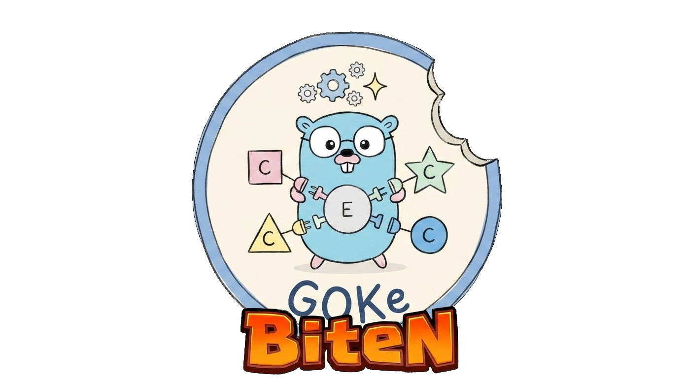

# gokebiten

<p align="center">
  
  <br>
  <a href="https://go.dev">
    
  </a>
  <a href="https://pkg.go.dev/github.com/kjkrol/gokebiten">
    
  </a>
  <a href="https://opensource.org/licenses/MIT">
    
  </a>
  <a href="https://goreportcard.com/report/github.com/kjkrol/gokebiten">
    
  </a>
  <a href="https://app.codecov.io/gh/kjkrol/gokebiten">
    
  </a>
  <a href="https://github.com/kjkrol/goke/actions">
    
  </a>
</p>

**gokebiten** integrates [goke](https://github.com/kjkrol/goke) — a type-safe, archetype-based
Entity Component System for Go — with [Ebitengine](https://ebitengine.org/). It wraps goke's
`ECS`/`System`/`Plan` model behind a small `Game` type that implements `ebiten.Game`, and layers
spatial indexing (via [GOKg](https://github.com/kjkrol/gokg)), kinematics, and collision
resolution on top.

## What's here

* `Game`/`Resources`/`TimeTracker` (repo root) — wires a goke `ECS` into Ebitengine's `Update`/
  `Draw`/`Layout` loop.
* `control/` — input capture and event dispatch.
* `physics/` — kinematics (movement, boundary handling) and collision detection/resolution
  (broad phase via `gokg.Space`, narrow phase, pluggable `CollisionHandler` strategies).
* `render/` — sprite batching, camera, tag-driven overlays, telemetry HUD.
* `spatial/` — population/spawn bookkeeping on top of a `gokg.Space`.

## Installation

```bash
go get github.com/kjkrol/gokebiten
```

## Example

[**examples/collision-demo**](./examples/collision-demo/main.go) — a real-time simulation of
thousands of moving, colliding AABBs at a fixed 120 TPS, built entirely on this package plus
goke's archetype-based storage and parallel systems.

<table>
  <thead>
    <tr>
      <th style="text-align: left; vertical-align: top; width: 400px;">
        <video src="https://github.com/user-attachments/assets/2b921500-eb3e-49bf-98ee-ac741746e64d" width="400" autoplay loop muted playsinline></video>
        <br>
          <sub><strong>Stats:</strong> 2306 colliding AABBs | 120 TPS | 50 collisions/tick</sub>
      </th>
      <th style="text-align: left; vertical-align: top; width: 400px;">
        <video src="https://github.com/user-attachments/assets/50695c5a-4f77-4352-87da-1fa13168415b" width="400" autoplay loop muted playsinline></video>
        <br>
        <sub><strong>Stats:</strong> 524 colliding AABBs | 120 TPS | 15 collisions/tick</sub>
      </th>
    </tr>
  </thead>
</table>

Run it locally:

```bash
make run
```

## Prerequisites

* Go 1.27+
* [Ebitengine dependencies](https://ebitengine.org/en/documents/install.html) (C compiler and
  system libraries — Ebitengine uses cgo on most platforms)

## Relationship to goke

This package used to live inside `goke`'s `examples/ebiten-demo`; it has been extracted into its
own repository so `goke`'s core stays free of GUI dependencies while this integration can evolve
(and version) independently. See [goke](https://github.com/kjkrol/goke) for the ECS engine itself.

## License

MIT — see [LICENSE](./LICENSE).
